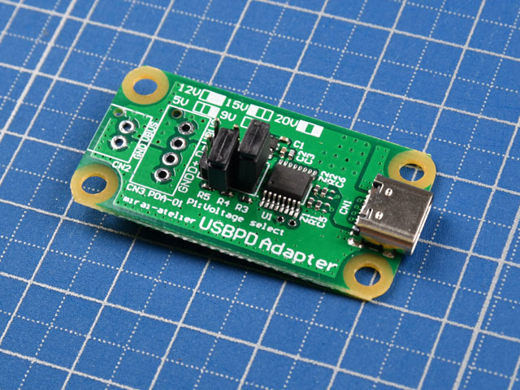
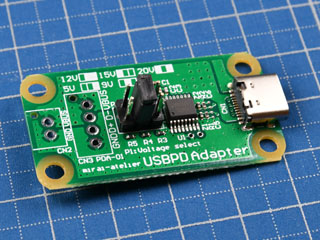
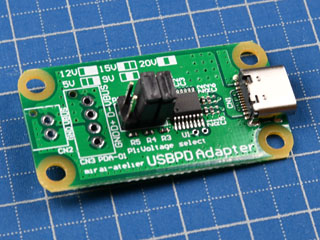
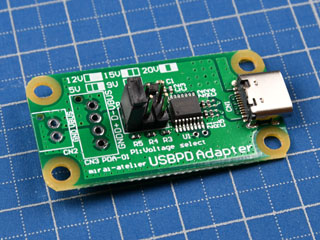

# USB-PD_Adapter
-PDから電圧ぶっこ抜く-

 

## これは何？
Mac book や ニンテンドーSwitch などの USB Type-C Power Derivery 対応のACアダプタやモバイルバッテリーのようなPDソース機器からPDOに従った任意の電源を取り出すためのモジュールです．

USB 2.0 の信号線も取り出すことができるので，既存のUSB機器などを簡単にPD対応させることができます．

## USB-PDとは？
これまでUSBホスト機器やACアダプタから提供されるバスパワー電圧は5Vを基本に，電流は最大でも2.1A程度でした．

これが USB PD の仕様上は20V5Aまで(本機では20V3Aまで利用可能です)拡張されました．ただし，ケーブルを繋いだだけで得られるのは5Vまでであり，それを超える電圧を得るためには PD のために設けられた CC の通信線を用いてソース機器と通信を行う必要があります．

また，従来のモバイルバッテリーではスマートフォンなどを充電完了した際に自動的に出力をオフにする機能があるため，消費電流の小さな負荷を接続した際に意図せず出力をオフにされてしまう問題がありました．USB PD 対応出力のあるモバイルバッテリーであればこの問題を回避することができます．

## 注意
全ての USB PD ソース機器との接続や動作を保証するものではありません．

USB PD 規格仕様により，VBUSに接続できる容量に制限があり，PDのネゴシエーション後で最大100uFです．大容量の負荷を接続した場合にPDソース機器が過電流保護を働かせる場合があります．その際には負荷側にロードスイッチ等を設けてください．

また，USB PD ソース機器が対応した電圧のみ取り出すことができます．設定した電圧が必ず取り出せるものではありません．

本機を用いて取り出せる電圧，電流は20V3Aまでです．

本機上には出力電圧や出力電流を制限する仕組みがありません．過負荷等により発熱する恐れがありますので，必ず出力電圧や電流を確認の上使用してください．

検査後に出荷しています．基板の取扱や接続する機器によって容易に破損する可能性があります．取扱には注意してください．

本機を使用したことによるいかなる損害については保証いたしかねます．

## 電圧設定方法
本機上のピンヘッダP1に取り付けるジャンパーによって電圧を設定できます．以下を参照してください

| ジャンパー位置 | 電圧 |
|:--------------|:----|
|     | 5V  |
|     | 9V  |
|   | 12V |
|   | 15V |
|   | 20V |
| その他        | 使用しません |

## CN2, CN3 について
電線を直接はんだ付けするほか，日本圧着端子製造(JST)のXHコネクタ又は2.54mmピッチのピンヘッダをはんだ付け可能です．

ハーネスを用いてVBUSとD+,D-を取り出すことができます．

コネクタやハーネスは付属していません．別途ご用意してください．

コネクタを予めはんだ付けされたものや，カスタム品も提供可能です．大量購入などもメール(maruyamaあっとmirai-atelier.com)又はTwitter(@betaEncoder)にてお問い合わせください．

## 基板サイズ(図面)
簡易的な図面と3Dモデルを用意しました．PDFとSTEPファイルがダウンロード可能です．

このデータは寸法を保証するものではありません．参考値としてご利用ください．

[PDF](PD_Adapter.PDF)

[STEP](PD_Adapter.step)